<!-- $$
\newcommand{\bx}{\mathbf{x}}
\newcommand{\by}{\mathbf{y}}
\newcommand{\bv}{\mathbf{v}}
\newcommand{\bu}{\mathbf{u}}
\newcommand{\cL}{\mathcal{L}}
\newcommand{\R}{\mathbb{R}}
\newcommand{\ra}{\rightarrow}
$$ -->

# Online Learning Methods

<!-- [TOC] -->

# 变分持续学习

## 1. 摘要

论文提出了变分持续学习（VCL），这是一种简单但通用的持续学习框架，结合了在线变分推断（VI）和神经网络中蒙特卡罗 VI 的最新进展。

## 2. 引言

持续学习（也称为终身学习和增量学习）是一种非常通用的在线学习形式，其中数据以可能非独立同分布的方式持续到达，任务可能会随时间变化（例如，可能会发现新类别），并且可能会出现完全新的任务。

持续学习系统必须以一种避免在每个阶段重新访问所有先前数据的方式，逐步适应以在所有任务集上表现良好。

然而，在适应新数据和保留旧数据知识之间保持平衡具有挑战性。过多的可塑性会导致著名的灾难性遗忘问题，而过多的稳定性则会导致无法适应。

一种方法是在每个任务上训练单独的模型，然后进行第二阶段的训练以组合它们。

一种更优雅且更灵活的方法是维护一个模型，并使用一种类型的正则化训练，这可以防止对预测有重大影响的参数发生剧烈变化，但允许其他参数更自由地变化。

持续学习已经存在一个极其通用的框架：贝叶斯推理。关键的是，贝叶斯推理保留了模型参数的分布，该分布表明了任何情景在观察到的数据下的可能性。当新的数据出现时，我们会将之前的数据所告诉我们的关于模型参数的信息（之前的后验分布）与当前数据所传达的信息（似然函数）结合起来。乘以并重新归一化得到新的后验，从这一点我们可以递归。

关键的是，之前的后验约束了强烈影响预测的参数，防止它们发生剧烈变化，但允许其他参数发生变化。难点在于精确的贝叶斯推理通常是难以处理的，因此需要近似。

论文将在线变分推断（VI）与神经网络的蒙特卡罗 VI结合，得出变分持续学习（VCL）。此外，论文通过将 VI 与核心集数据摘要方法结合，将 VCL 扩展为包括一个小的短期记忆。

> （1）在线变分推断VI
>
> （2）神经网络蒙特卡洛VI
>
> （3）结合VI和核心集数据摘要方法

## 3. 方法

在看到第 $T$ 个数据集后，计算模型参数 $\theta$ 的概率分布遵循贝叶斯公式：
$$
p(\theta|\mathcal{D}_{1:T}) \propto p(\theta) \prod_{t=1}^{T} \prod_{n_t=1}^{N_t} p(y_t^{(n_t)}|\theta, x_t^{(n_t)}) = p(\theta) \prod_{t=1}^{T} p(\mathcal{D}_t|\theta) \propto p(\theta|\mathcal{D}_{1:T-1})p(\mathcal{D}_T|\theta)
$$
最后一项把长长的连乘变成了一个简单的 **递归关系** ：

- $p(\theta|\mathcal{D}_{1:T-1})$: 这是 **“昨天的后验”** 。即在看到最新数据 $\mathcal{D}_T$ 之前，基于过去 $T-1$ 个数据集学到的知识。在这一步计算中，它变成了 **“今天的先验”**。

- $p(\mathcal{D}_T|\theta)$: 这是 **“今天的新数据似然”**。即当前第 $T$ 个数据集带来的新信息。

最后一项可以识别出一个递归关系，即在看到 $T-th$ 数据集后的后验分布是通过取看到 $(T-1)-th$ 数据集后的后验分布，乘以似然并重新归一化得到的。换句话说，在线更新自然地从贝叶斯规则中出现。

**昨天的终点，就是今天的起点。**今天的“后验”（学到的新知识）直接成为明天的“先验”（旧经验）。 这就是贝叶斯规则赋予在线更新的“天赋”。贝叶斯方法天生适合“在线学习”或“持续学习”。

这里复习一下贝叶斯公式：
$$
\underbrace{P(H|E)}_{\text{后验 (Posterior)}} = \frac{\overbrace{P(E|H)}^{\text{似然 (Likelihood)}} \cdot \overbrace{P(H)}^{\text{先验 (Prior)}}}{\underbrace{P(E)}_{\text{证据 (Evidence)}}}
$$
但是现实是，后验分布难计算（Intractability）。 真实的后验分布通常非常复杂、不规范，无法直接解析计算（Intractable）。解决方案就是使用近似（Approximation）。将复杂的真实分布“投影”（proj）到一个易于处理的分布族（如高斯分布）上。
$$
q_T(\theta) = \text{proj}(q_{T-1}(\theta) \times p(\mathcal{D}_T|\theta))
$$

即用简单的 $q(\theta)$ 去逼近复杂的 $p(\theta)$。

为了实现这个“投影”操作，论文列举了四种主流的近似推断技术及其对应的在线算法：

1. **拉普拉斯近似 (Laplace Approximation)** $\rightarrow$ 对应算法：拉普拉斯传播 (Laplace Propagation)
2. **变分 KL 最小化 (Variational KL Minimization)** $\rightarrow$ 对应算法：**在线变分推断 (Online VI) / 流变分贝叶斯**
3. **矩匹配 (Moment Matching)** $\rightarrow$ 对应算法：假设密度滤波 (Assumed Density Filtering)
4. **重要性采样 (Importance Sampling)** $\rightarrow$ 对应算法：顺序蒙特卡罗 (Sequential Monte Carlo)

### 变分持续学习

变分连续学习通过在允许的近似后验集合 Q 上进行 KL 散度最小化来定义投影算子，
$$
q_t(\theta) = \arg \min_{q \in Q} \text{KL}\left(q(\theta) \parallel \frac{1}{Z_t} q_{t-1}(\theta) p(\mathcal{D}_t|\theta)\right), \text{for } t = 1,2,\ldots, T.
$$
$Q$一般为高斯分布族，$Z_t$是 $p^∗_t (θ) = q_{t−1}(θ) p(D_t|θ)$ 的不可处理的归一化常数，并不需要计算最优值。

第零近似分布被定义为先验，$q_0(\theta) = p(\theta)$，这设定了递归的起点。在没有任何数据之前，我们通常假设参数服从一个标准的先验分布（例如标准正态分布 $\mathcal{N}(0, I)$）。

**真正的后验 (True Posterior)** 是 $p(\theta | \mathcal{D}_{1:t})$。**变分后验 (Variational Posterior)** 是 $q_t(\theta)$。$q_t(\theta)$ 是为了解决真实后验无法计算的难题，通过优化手段在简单分布族（如高斯）中人为选出的 **“最佳替身”函数**，它在数值上逼近真后验，但在数学定义上并非通过贝叶斯公式算出的条件概率。

> ### VI公式解释
>
> （1）$t = 1, 2, \dots, T$:表示我们按顺序学习多个任务。
>
> （2）$q_{t-1}(\theta)$ (上一步的近似后验):
>
> 这是模型在学习完上一个任务后，对参数 $\theta$ 的理解。在当前任务 $t$ 中，它充当了先验 (Prior) 的角色。它包含了过去所有任务的记忆，防止“灾难性遗忘”。
>
> （3）$p(\mathcal{D}_t|\theta)$ (当前任务的似然):
>
> 这是当前任务 $t$ 的数据 $\mathcal{D}_t$ 对模型的反馈。它告诉模型：“为了解释当前数据，参数 $\theta$ 应该长什么样”。
>
> （4）$\frac{1}{Z_t} q_{t-1}(\theta) p(\mathcal{D}_t|\theta)$ (目标分布 / 真实后验):
>
> 这是我们理想中想要得到的参数分布。它是“过去的记忆”与“当前的数据”的结合。
>
> - 然而，这个分布通常非常复杂，甚至无法解析（Intractable），所以我们无法直接使用它。
>
> （5）$Q$ (近似集合):
>
> 为了解决上述的“复杂不可解”问题，我们设定一个简单的分布家族 $Q$（例如高斯分布家族）。我们要在这个简单的家族里找一个成员来代替复杂的真实后验。
>
> （6）$q_t(\theta)$ (当前的近似后验):
>
> 这是我们在 $Q$ 集合中找到的、最能代表真实情况的分布。它将作为下一个任务 $t+1$ 的先验。
>
> （7）$\text{KL}(\cdot \parallel \cdot)$ (KL 散度):
>
> 这是一个衡量两个概率分布之间差异的指标。
>
> - $\arg \min \text{KL}$ 的意思就是：**在简单的分布集合 $Q$ 中，找到一个分布 $q$，使得它与那个理想的、复杂的真实后验分布之间的差异最小。**
> - 文中提到的“**投影算子 (Projection Operator)**”就是指这个过程——将复杂的真实分布“投影”到一个简单的流形 $Q$ 上。

针对变分持续学习（VCL）因多步近似推断导致误差累积及旧任务遗忘的问题，论文提出引入**“核心集”（Coreset）**机制进行扩展。核心集通过保留先前任务的少量代表性数据，构建类似**情景记忆**的机制，使算法能够重访关键旧数据以“刷新”记忆，从而有效弥补近似偏差，缓解灾难性遗忘。

结合VI和核心集数据情景记忆方法伪代码：

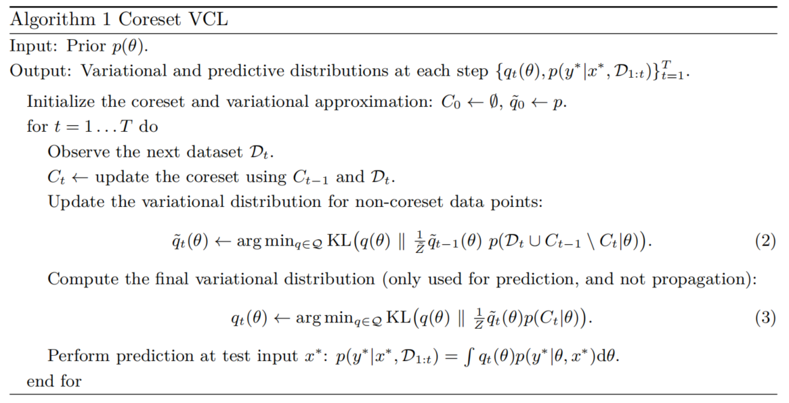

每次保留的新核心集为$C_t$， 除核心集剩下所有的数据为（$\mathcal{D}_t \cup C_{t-1} \setminus C_t$）。

**$\tilde{q}_t(\theta)$：**  这是 **“长期记忆”**。它是要传给下一个任务 $t+1$ 继续使用的。它必须包含所有 **不再被保留** 的数据的知识。

**$q_t(\theta)$：** 这是 **“临考状态”**。它只用来做当前的预测，**不传给下一个任务**。

以上公式 (2) 的意思就是：用上一步的长期记忆 $\tilde{q}_{t-1}$ 作为基础，把这些**即将被丢弃的数据**里的知识，彻底“消化”进大脑（参数）里，形成新的长期记忆 $\tilde{q}_t$。

公式 (3) 的意思就是：拿刚才更新好的长期记忆 $\tilde{q}_t$ 当作基础（先验），再专门针对手里保留的**精华数据（核心集 $C_t$）** 进行一次强化训练。

贝叶斯推理的公式如下：
$$
p(y^* | x^*, \mathcal{D}_{1:t}) = \int q_t(\theta) p(y^* | \theta, x^*) d\theta
$$

>### 推理公式解释
>
>（1）$p(y^* | \theta, x^*)$ (专家的意见)：如果模型的参数固定为 $\theta$（比如神经网络的一组特定权重），模型会对 $x^*$ 做出的预测结果。
>
>（2）$q_t(\theta)$ (对专家的信任度)：这是在伪代码公式(3)中刚刚计算出来的当前任务的最佳参数分布。它告诉我们，参数取某个值 $\theta$ 的可能性有多大。
>
>（3）$\int \dots d\theta$ (综合所有意见)：因为我们是贝叶斯学派，我们认为参数 $\theta$ 不是一个固定的值，而是一个分布。
>
>- 我们不只听一个“专家”（一组权重）的意见。
>- 我们听取**所有可能**的参数配置（无穷多个 $\theta$）的意见。
>- 然后根据 $q_t(\theta)$ 对这些意见进行加权平均。
>
>（4）在深度神经网络中，这个积分是算不出来的（因为 $\theta$ 维度太高）。所以在实际代码实现时，通常使用 **蒙特卡洛采样 (Monte Carlo Sampling)** 来近似：
>
>1. 从分布 $q_t(\theta)$ 中随机抽取 $K$ 组参数 $\theta_1, \theta_2, \dots, \theta_K$（比如抽 10 次）。
>2. 让这 $K$ 个模型分别跑一遍预测。
>3. 取这 $K$ 个结果的平均值作为最终答案。

由核心集计算得到真实后验分布是有一定理论推导的，首先把核心集从真实后验分布$p(\theta | \mathcal{D}_{1:t})$中分离出来：
$$
p(\theta | \mathcal{D}_{1:t}) \propto \underbrace{p(\theta | \mathcal{D}_{1:t} \setminus C_t)}_{\text{除去核心集的后验}} \times \underbrace{p(C_t | \theta)}_{\text{核心集的似然}}  \approx \tilde{q}_t(\theta) p(C_t | \theta)
$$

贝叶斯公式告诉我们：$Posterior \propto Prior \times Likelihood, 后验 \propto 先验 \times 似然$

如果我们把**非核心集**训练出来的结果暂时看作 **“先验”**，那么再加上核心集的 **“似然”**，就能得到完整的 **“后验”**。

因为真实的“非核心集后验” $p(\theta | \mathcal{D}_{1:t} \setminus C_t)$ 很难算（intractable）。所以我们用 **变分近似分布** $\tilde{q}_t(\theta)$ 来 **代替**这个真实后验。

非核心集的后验分布估计同样也是有理论依据的，符合一个递归关系或者消息传递：

$$
p(\theta | \mathcal{D}_{1:t} \setminus C_t) = \underbrace{p(\theta | \mathcal{D}_{1:t-1} \setminus C_{t-1})}_{\text{① 旧的长期记忆}} \times \underbrace{p(C_{t-1} \setminus C_t | \theta)}_{\text{② 从旧核心集中被踢出的数据}} \times \underbrace{p(\mathcal{D}_t \setminus C_t | \theta)}_{\text{③ 新数据中没入选的数据}}\approx \tilde{q}_{t-1}(\theta) p(\mathcal{D}_t \cup C_{t-1} \setminus C_t | \theta)
$$

原来的核心集和新的数据集都要去除当前核心集。

消息传递传播是通过 $\tilde{q}_t(\theta) = \text{proj}(\tilde{q}_{t-1}(\theta)p(\mathcal{D}_t \cup C_{t-1} \setminus C_t|\theta))$ 进行的，VCL 采用变分 KL 投影。在执行预测 $q_t(\theta) = \text{proj}(\tilde{q}_t(\theta)p(C_t|\theta))$ 之前需要进一步的投影步骤。

### 深度判别模型中的变分持续学习

在判别式持续学习的简单实例中，当数据以独立同分布的方式到达，或者仅输入分布 $p(x_{1:T})$ 随时间变化时，标准的单头判别式神经网络就足够了。在许多情况下，尽管任务相关，但可能涉及不同的输出变量。多任务学习中的标准做法是使用在输入附近共享参数但每个输出有单独头部的网络，因此称为多头网络。

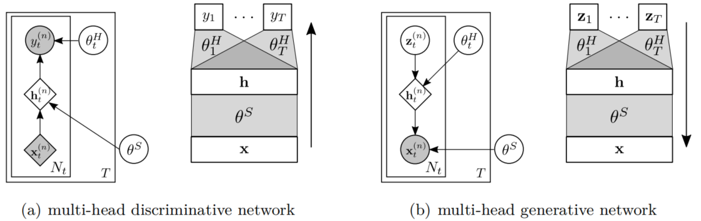

低层网络由变量$\theta^S$参数化，并在多个任务之间共享。每个任务$t$都有自己独立的“头网络”$\theta_t^H$，用于从公共隐藏层映射到输出。因此，所有参数集为$\theta=\{\theta_{1:T}^H, \theta^S\}$ 。

多头网络更新策略:

- **共享参数**：随着每个任务不断更新。
- **任务私有参数（Heads）**：
  - 未遇到的任务：保持先验分布 $p(\theta)$ 不变。
  - 当前任务 $\mathcal{D}_t$：仅更新对应的头参数后验。

> ### ELBO推导
>
> #### 1. 推导出发点：KL 散度
>
> 我们要让近似分布 $q(\theta)$ 尽可能接近真实后验 $p(\theta|\mathcal{D})$，数学上等价于最小化两者之间的 **KL 散度**：
>
> $$
> \text{KL}(q(\theta) || p(\theta|\mathcal{D})) = \mathbb{E}_{q} [\log q(\theta)] - \mathbb{E}_{q} [\log p(\theta|\mathcal{D})]
> $$
>
> #### 2. 引入贝叶斯公式
>
> 根据贝叶斯定理，$p(\theta|\mathcal{D}) = \frac{p(\mathcal{D}|\theta)p(\theta)}{p(\mathcal{D})}$。将其代入上面的式子：
>
> $$
> \begin{aligned} \text{KL}(q || p(\theta|\mathcal{D})) &= \mathbb{E}_{q} [\log q(\theta)] - \mathbb{E}_{q} [\log \frac{p(\mathcal{D}|\theta)p(\theta)}{p(\mathcal{D})}] \\ &= \mathbb{E}_{q} [\log q(\theta)] - \mathbb{E}_{q} [\log p(\mathcal{D}|\theta)] - \mathbb{E}_{q} [\log p(\theta)] + \underbrace{\log p(\mathcal{D})}_{\text{与} \theta \text{无关，常数}} \end{aligned}
> $$
>
> #### 3. 移项得到 ELBO
>
> 我们要最大化对数证据 (Log Evidence) $\log p(\mathcal{D})$。通过移项，我们得到：
>
> $$
> \log p(\mathcal{D}) = \underbrace{\mathbb{E}_{q} [\log p(\mathcal{D}|\theta)] - \text{KL}(q(\theta) || p(\theta))}_{\text{ELBO}} + \underbrace{\text{KL}(q(\theta) || p(\theta|\mathcal{D}))}_{\ge 0}
> $$
>
> **关键点：**
>
> - 因为 KL 散度永远非负 ($\ge 0$)，所以 **ELBO 是 $\log p(\mathcal{D})$ 的下界 (Lower Bound)**。
> - **最大化 ELBO** 等价于 **最小化 $q$ 和真实后验之间的 KL 散度**（因为 $\log p(\mathcal{D})$ 是固定的）。

标准的 ELBO 公式为：$$\text{ELBO} = \mathbb{E}_{q} [\log p(\mathcal{D}|\theta)] - \text{KL}(q(\theta) || p(\theta))$$

在 **VCL (Variational Continual Learning)** 场景下，这个公式做了一点微调来适应“持续学习”：

1. 似然项 (第一项)：$\sum \mathbb{E}_{\theta \sim q_t} [\log p(y_t^{(n)} | \theta, x_t^{(n)})]$。这是任务 $t$ 的数据上的期望对数似然。
2. 先验项 (第二项)：在持续学习中，上一个任务的后验 $q_{t-1}(\theta)$ 变成了当前任务的先验。
   - 标准 VI 中，先验是固定的 $p(\theta)$。
   - VCL 中，先验是动态的 $q_{t-1}(\theta)$。
   - 因此，KL 项变成了 $\text{KL}(q_t(\theta) || q_{t-1}(\theta))$。

因此基于最大化在线变分下界（ELBO），损失函数定义为：

$$
\mathcal{L}^t_{\text{VCL}} = \underbrace{\sum \mathbb{E}_{q_t}[\log p(y|\theta, x)]}_{\text{期望对数似然}} - \underbrace{\text{KL}(q_t(\theta) || q_{t-1}(\theta))}_{\text{KL 散度}}
$$

- **KL 项**：衡量当前后验与上一时刻后验（即当前先验）的差异，支持**闭式计算**。

- **似然项**：使用简单蒙特卡洛方法结合**本地重参数化技巧 (Local Reparameterization Trick)** 进行梯度估算。

**初始化**$t=0$ 时的先验 $q_0(\theta)$ 设为多元高斯分布。

### 深度生成模型中的变分持续学习

#### VAE损失适配VCL损失

> ### VAE损失函数
>
> VAE的目标就是$\min~ KL\Big(q_{\phi}(z\mid x) \Big\Vert p(z\mid x)\Big)$ 。
>
> 因此有：
> $$
> \begin{align*}
> &KL(q_\phi(z \mid x) \| p(z \mid x)) \\
> &= \int q_\phi(z \mid x) \log \left[ \frac{q_\phi(z \mid x)}{p(z \mid x)} \right] dz \\
> &= \int q_\phi(z \mid x) \log \left[ \frac{q_\phi(z \mid x)p(x)}{p(z, x)} \right] dz  \qquad \boxed{条件概率公式：p(x, z) =p(z\mid x) p(x)}\\
> &= \int q_\phi(z \mid x) \log \left[ \frac{q_\phi(z \mid x)}{p(z, x)} \right] dz + \int q_\phi(z \mid x) \log p(x) dz \quad \\ &\boxed{\int_z q_{\phi}(z | x) \log p(x)dz = \mathbb{E}_{z\sim q_{\phi}(z \mid x)}(\log p(x)) = \log p(x)} \\
> &=  \mathbb{E}_{z\sim q_{\phi}(z \mid x)} \log \left[ \frac{q_\phi(z \mid x)}{p(z, x)} \right] + \log p(x) \\
> &KL(q_\phi(z \mid x) \| p(z \mid x)) +  \mathbb{E}_{z\sim q_{\phi}(z \mid x)} \log \left[ \frac{p(z, x)}{q_\phi(z \mid x)} \right] = \log p(x)
> \end{align*}
> $$
> 经过如上推导，一般通常把$\mathbb{E}_{z\sim q_{\phi}(z \mid x)} \log \left[ \frac{p(z, x)}{q_\phi(z \mid x)} \right]$称为ELBO（Evidence Lower Bound,证据下界），上式的$\log p(x)$其实给定$x$后，就是一个固定的值，为了最小化KL散度，因此只需要最大化ELBO值。
>
> 继续推导，最大化ELBO：
> $$
> \begin{align*}
> ELBO&=\max \int_z \log \frac{P(x, z)}{q_{\phi}(z \mid x)} q_{\phi}(z \mid x) dz \\
> &= \max \int_z \log \frac{P(x \mid z)P(z)}{q_{\phi}(z \mid x)} q_{\phi}(z \mid x) dz \\
> &= \max \int_z \left( \log \frac{P(z)}{q_{\phi}(z \mid x)} + \log P(x \mid z) \right) q_{\phi}(z \mid x) dz \\
> &= \max \int_z \log P(x \mid z) q_{\phi}(z \mid x) dz - \int_z \log \frac{q_{\phi}(z \mid x)}{P(z)} q_{\phi}(z \mid x) dz \\
> &= \max \left( \underbrace{\mathbb{E}_{z \sim q_{\phi}(z \mid x)} [\log P(x \mid z)]}_{\text{①}} - \underbrace{KL(q_{\phi}(z \mid x) \| P(z))}_{\text{②}} \right)
> \end{align*}
> $$
> 由此，ELBO分为了两部分，第一部分是重构项（L2 loss），也就是我们平常说的MSE（$\dfrac{1}{2}\mid \mid x - \hat{x}\mid \mid ^2$）, 第二项是先验匹配项（KL loss），也就是让编码器和采样的正态分布分布形式更相似。

近似最大似然估计方法在持续学习情景中不适用，做的是点估计，参数是定的。

持续学习中，参数必须是活的，VCL采用贝叶斯神经网络的思路，认为参数 $\theta$ 不是一个确定的数，而是一个 **概率分布** $q_t(\theta)$。既然参数 $\theta$ 是在变动的（是一个分布），那么每一次从这个分布里采样出一个 $\theta$​，模型算出来的 Loss（误差）都会不一样。为了评估模型的好坏，我们不能只看某一次采样的结果，而要看 **“在参数 $\theta$ 的所有可能性下，模型的平均表现如何”**。这就叫 **对 $\theta$ 求期望** ($\mathbb{E}_{q_t(\theta)}$)。

VCL提出的损失函数为：
$$
\mathcal{L}_{\text{VCL}}^t(q_t(\theta), \phi) = \underbrace{\mathbb{E}_{q_t(\theta)} \left[ \sum_{n=1}^{N_t} \mathbb{E}_{q_\phi(z_t^{(n)}|x_t^{(n)})} \left[ \log \frac{p(x_t^{(n)}|z_t^{(n)}, \theta)p(z_t^{(n)})}{q_\phi(z_t^{(n)}|x_t^{(n)})} \right] \right]}_{\text{第一部分：适应新任务 (Likelihood)}} - \underbrace{\text{KL}(q_t(\theta) || q_{t-1}(\theta))}_{\text{第二部分：记忆旧任务 (Prior)}}
$$

- **前一部分 $\mathbb{E}[\dots]$**：依然是努力学好当前的新任务（让 $x$ 重构得好）。

- **后一部分 $-\text{KL}(\dots)$**：这是一个**惩罚项**。它要求**现在的参数分布 $q_t$ 不能偏离上一个任务学到的参数分布 $q_{t-1}$ 太远**。

通常代码里是最小化 Loss，所以是上面公式的**相反数**：

$$
\text{Loss} = \text{KL}(q_t(\theta) || q_{t-1}(\theta)) - \mathbb{E}_{q_t(\theta)} \left[ \text{VAE\_ELBO} \right]
$$

#### 生成式模型架构

对于多种任务，论文将生成式模型分为共享部分和任务特定部分。网络的结构位置大概是($z \rightarrow h \rightarrow x$)模式的，$h$代表中间层表示。

生成式模型架构有两种：

- 架构1：**$z \rightarrow h$（高层生成）：** 是**私有**的。**$h \rightarrow x$（底层生成）：** 是**共享**的（任务特定的）。
- 架构2：**$z \rightarrow h$（高层生成）：** 是**共享**的。**$h \rightarrow x$（底层生成）：** 是**私有**的（任务特定的）。

作者决定采用**架构 (i)**（共享底层生成网络，保留私有高层头网络）。

1. **架构优势（架构 i）：** 在任务间**共享**负责生成观测值 $x$ 的网络（基于中间层 $h$），但拥有**私有**的从潜变量 $z$ 生成 $h$ 的网络。这种方式适合由共同结构基元（如手写数字的笔画）组成的数据。
2. **排除方案（架构 ii）：** 相反的架构被证明会将任务信息完全编码在特定底层网络中，导致无法实现**多任务迁移**。

## 4. 相关工作

### 深度判别模型的持续学习

神经网络持续学习方法一般都采用正则化极大似然估计，优化如下形式的目标：
$$
\mathcal{L}^t(\theta) = \sum_{n=1}^{N_t} \log p(y_t^{(n)} \mid \theta, x_t^{(n)}) - \frac{1}{2} \lambda_t(\theta - \theta_{t-1})^T \sum_{t - 1}^{-1} (\theta - \theta_{t-1})
$$

**常规的神经网络训练（找最大值）只能给你参数的最佳数值（$\theta$），却算不出参数的重要性/不确定性（$\Sigma$）。** 而没有这个 $\Sigma$，你就没法精确地告诉下一个任务“哪些参数不能动”，从而无法有效地进行持续学习。因此如何有效设计$\Sigma$表示参数的重要性极为关键。

大脑基于神经突触可塑性机制进化出复杂的神经认知功能，基于这一思想，参数正则化方法构建权重巩固机制，**对网络中重要的神经元连接施加保护**。具体来讲，在训练第$t$个任务时，参数正则化的方法具有如下形式正则损失:

$$
\mathcal{L}_{reg} = \sum_{i} \Omega_{t-1}^i (\theta_t^i - \theta_{t-1}^i)^2
$$

其中:

- $\theta_t^i$和$\theta_{t-1}^i$分别是新模型和旧模型的第$i$个参数;

- $\Omega_{t-1}^i$为该参数对第$t-1$个任务的重要程度。

参数正则化的方法关键在于如何进行参数的重要性估计。

#### 极大似然估计和最大后验估计

优化目标的正则化项可以解释为高斯先验，$q(\theta \mid D_{1:t-1}) = \mathcal{L}(\theta;\theta_{t-1}, \sum_{t-1}/\lambda_t)$。

> ### MLE vs MAP
>
> 极大似然估计 (MLE)：
> $$
> \hat{\theta}_{MLE} = \operatorname*{argmax}_{\theta} \ P(X | \theta)
> $$
>
> 最大后验估计 (MAP)
>
> $$
> \hat{\theta}_{MAP} = \operatorname*{argmax}_{\theta} \ P(\theta | X) = \operatorname*{argmax}_{\theta} \ \frac{P(X | \theta) P(\theta)}{P(X)}
> $$
>
> - 由于 $P(X)$ 与 $\theta$ 无关，公式简化为：
>
> $$
> \hat{\theta}_{MAP} = \operatorname*{argmax}_{\theta} \ \underbrace{P(X | \theta)}_{\text{似然}} \cdot \underbrace{P(\theta)}_{\text{先验}}
> $$
>
> - **关键点：** MAP 多了一个项 **$P(\theta)$**，这就是**先验概率 (Prior)**。

**常规的神经网络训练（找最大值）只能给你参数的最佳数值（$\theta$），却算不出参数的重要性/不确定性（$\Sigma$）。** 而没有这个 $\Sigma$，你就没法精确地告诉下一个任务“哪些参数不能动”，从而无法有效地进行持续学习。

>### 高斯分布蕴含的参数重要性
>
>一个高斯分布由两个东西决定：
>
>1. **均值 ($\mu$ 或 $\theta$)：** 告诉下一位，“我的参数最佳值大概在这里”。
>2. **方差/协方差矩阵 ($\Sigma$)：** 告诉下一位，“这个参数**有多重要**（或者说我有多确定）”。
>   - 如果 $\Sigma$ 很小（方差小）：说明这个参数非常重要，在这个位置必须要精准（山峰很尖），**下一步千万别动它**。
>   - 如果 $\Sigma$ 很大（方差大）：说明这个参数无所谓，大概在这个范围就行（山峰很平），**下一步可以随便改**。

一个简单的解决方法是设置$\Sigma_t = 1$,并使用交叉验证来找到$\lambda_t$，但这种近似通常过于粗糙并导致灾难性遗忘。**“$\Sigma_t = I$”**（单位矩阵）,假装所有山峰都是一样宽的，假装所有参数一样重要,因此会导致灾难性遗忘。

#### 拉普拉斯传播

核心公式为：

$$
% 递归公式
\Sigma_t^{-1} = \Phi_t + \Sigma_{t-1}^{-1}
% Phi_t 的定义 (where 条件)
\text{ 其中 }  \Phi_t = -\nabla\nabla_\theta \sum_{n=1}^{N_t} \log p(y_t^{(n)} | \theta, x_t^{(n)}) \bigg|_{\theta=\theta_t}  \text{ 且 } \lambda_t = 1.
$$

​    定义 $\Phi_t =  -\nabla\nabla_\theta \sum_{n=1}^{N_t} \log p(y_t^{(n)} | \theta, x_t^{(n)}) \bigg|_{\theta=\theta_t}$ 。

这里的 $\nabla\nabla$ 代表二阶导数，也就是数学上的海森矩阵 (Hessian Matrix)。

- **一阶导数 ($\nabla$)：** 告诉你山坡是**上坡还是下坡**（梯度）。
- **二阶导数 ($\nabla\nabla$)：** 告诉你山顶是**尖锐的还是平坦的**（曲率）。

> 直观理解：
>
> - **如果 $\Phi_t$ 很大（山峰很尖）：** 说明在这个任务中，参数只要稍微动一点点，Loss 就会剧烈增加。这意味着**这个参数非常重要，必须死死锁住**。
>
> - **如果 $\Phi_t$ 很小（山峰平坦）：** 说明参数随便动，Loss 也没啥变化。这意味着**这个参数不重要，下一个任务可以随便改它**。

为了避免计算似然的完整 Hessian 矩阵，对角线 Laplace 传播仅保留 $\Sigma_t^{-1}$ 的对角线项。

>### 改进的Laplace Approximation
>
>拉普拉斯近似本质上是通过最大后验估计（MAP）点$\theta^{*}$处的二阶泰勒多项式来近似对数后验$\log p(\theta \mid D)$。更具体地，我们首先通过求解以下最优化问题来获得MAP估计$\theta^{*}$，通常使用随机梯度下降（SGD）方法：
>$$
>\theta ^{*} = \arg \max_{\theta} \log p(\theta \mid D) = \arg \max_{\theta} \log p(\theta) + \log p(D \mid \theta)
>$$
>
>然后我们通过在$\theta=\theta^{*}$处的二次泰勒多项式来近似$\log p(\theta \mid D)$,由于在（局部）最优解处梯度消失（即$\nabla \log p(\theta^{*} \mid D)=0$）,该表达式简化如下：
>$$
>\log p(\theta \mid D) \approx \dfrac{1}{2}(\theta - \theta^{*}) \nabla^2\log p(\theta^{*} \mid D)(\theta - \theta^{*}) + const
>$$
>假设Hessian矩阵$\nabla^2 \log p(\theta^{*} \mid D)$为负定，上式变换为高斯分布：
>$$
>p(\theta \mid D) = \mathcal{N}\left(\theta;\theta^{*}, -(\nabla^2 \log p(\theta^* \mid D))^{-1}\right)
>$$
>上式海森矩阵计算和逆矩阵求解是一个比较著名的挑战，海森矩阵内存开销$O(d^2)$, 逆矩阵求解需要高昂的$O(d^3)$的计算时间。为应对计算复杂性，LA考虑采用对角海森矩阵近似。其次，为应对海森矩阵计算的开销，LA采用著名的经验费舍信息近似来近似海森矩阵。对角经验费舍近似的推理如下：
>$$
>\nabla^2 \log p(\theta^{*} \mid D) = \nabla^2 \log p(\theta^*) + \sum_{n = 1}^{N} \nabla^2 \log p(y_n \mid x_n, \theta^*)
>$$
>上式右边第二项可由经验费舍信息进行近似，其本质是将费舍信息中的模型分布$p(y \mid x, \theta)$用插补估计或经验分布$\frac{1}{N} \sum_{n = 1}^{N} \delta(y - y_n \mid x_n)$替代：
>$$
>\nabla^2 \log p(\theta^{*} \mid D) \approx  \nabla^2 \log p(\theta^*)  - \sum_{n=1}^{N} \nabla \log p(y_n \mid x_n, \theta^*) \nabla \log(y_n \mid x_n, \theta^*)^T
>$$
>>### Fisher信息矩阵
>>Fisher信息矩阵的公式如下：
>>$$
>>I(\theta) = \mathbb{E}_{p(x|\theta)} \left[ \nabla_\theta \log p(x|\theta) \cdot \nabla_\theta \log p(x|\theta)^\top \right] = - \mathbb{E}_{p(x|\theta)} \left[ \nabla_\theta^2 \log p(x|\theta) \right]
>>$$
>>矩阵中的元素 $I_{ij}(\theta)$ 计算的是参数 $\theta_i$ 和 $\theta_j$ 之间的相互关系：
>>$$
>>I_{ij}(\theta) = - \mathbb{E} \left[ \frac{\partial^2}{\partial \theta_i \partial \theta_j} \log p(x|\theta) \right]
>>$$
>>Fisher信息矩阵的定义基于一阶导数或者基于二阶导数，或者说基于梯度方差或者基于Hessian的期望，这两种形式为什么等价，也就是说为什么如下等式成立：
>>$$
>>-\mathbb{E}\left[\nabla^2 \log p(x|\theta)\right] = \mathbb{E}\left[\nabla \log p(x|\theta) \nabla \log p(x|\theta)^\top\right]
>>$$
>>前置知识：对数导数技巧(Log-Derivative Trick)：
>>$$
>>\nabla p(x|\theta) = p(x|\theta) \nabla \log p(x|\theta)
>>$$
>>(证明：根据链式法则 $\nabla \log f = \frac{\nabla f}{f} \implies \nabla f = f \cdot \nabla \log f$)
>>**证明过程**:
>>**第一步：从概率密度的归一化性质开始**
>>概率密度函数在全空间上的积分必须等于 1：
>>$$
>>\int p(x|\theta) \, dx = 1
>>$$
>>**第二步：两边对 $\theta$ 求一阶导数**
>>对等式两边同时对 $\theta$ 求导。假设满足**正则性条件**（Regularity Conditions，允许积分符号和微分符号交换），我们可以把微分移到积分内部：
>>$$
>>\nabla_\theta \left( \int p(x|\theta) \, dx \right) = \nabla_\theta (1) = 0
>>\implies \int \nabla_\theta p(x|\theta) \, dx = 0
>>$$
>>利用 **Log-Derivative Trick** ($\nabla p = p \cdot \nabla \log p$) 替换被积函数：
>>$$
>>\int p(x|\theta) \nabla_\theta \log p(x|\theta) \, dx = 0
>>$$
>>**物理意义：** 这说明 Score Function（对数似然的梯度）的期望值为 0，即 $\mathbb{E}[\nabla \log p(x|\theta)] = 0$。
>>**第三步：两边对 $\theta$ 再求一次导数（求 Hessian）**
>>对上面的等式（$\int p \cdot \nabla \log p \, dx = 0$）再进行一次关于 $\theta$ 的求导：
>>$$
>>\nabla_\theta \left( \int p(x|\theta) \nabla_\theta \log p(x|\theta)^\top \, dx \right) = 0
>>$$
>>*(注意：这里转置是为了匹配矩阵维度，结果是一个矩阵)*
>>再次将微分符号移入积分内部，并使用**乘积法则**（Product Rule, $(uv)' = u'v + uv'$）：
>>$$
>>\int \left[ \underbrace{\nabla_\theta p(x|\theta)}_{\text{第一项求导}} \cdot \nabla_\theta \log p(x|\theta)^\top + p(x|\theta) \cdot \underbrace{\nabla_\theta (\nabla_\theta \log p(x|\theta)^\top)}_{\text{第二项求导}} \right] \, dx = 0
>>$$
>>我们分别分析这两项：
>>1. **第一项展开：**再次使用 $\nabla p = p \cdot \nabla \log p$：
>> $$
>>  \nabla_\theta p(x|\theta) \cdot \nabla_\theta \log p(x|\theta)^\top = p(x|\theta) \nabla_\theta \log p(x|\theta) \nabla_\theta \log p(x|\theta)^\top
>> $$
>>   这一项包含了 **梯度的外积**。
>>2. **第二项展开：**$\nabla_\theta (\nabla_\theta \log p(x|\theta)^\top)$ 正是二阶导数，即 Hessian 矩阵：
>> $$
>>   \nabla_\theta^2 \log p(x|\theta)
>> $$
>>**第四步：代回积分并整理**
>>将展开后的两项代回积分公式：
>>$$
>>\int \left( p(x|\theta) \left[ \nabla_\theta \log p(x|\theta) \nabla_\theta \log p(x|\theta)^\top \right] + p(x|\theta) \left[ \nabla_\theta^2 \log p(x|\theta) \right] \right) \, dx = 0
>>$$
>>利用期望的定义 $\mathbb{E}[f(x)] = \int p(x)f(x)dx$，我们可以把积分写成期望形式：
>>$$
>>\mathbb{E} \left[ \nabla_\theta \log p(x|\theta) \nabla_\theta \log p(x|\theta)^\top \right] + \mathbb{E} \left[ \nabla_\theta^2 \log p(x|\theta) \right] = 0
>>$$
>>**第五步：移项得证**
>>将 Hessian 项移到等式右边：
>>$$
>>\mathbb{E} \left[ \nabla_\theta \log p(x|\theta) \nabla_\theta \log p(x|\theta)^\top \right] = - \mathbb{E} \left[ \nabla_\theta^2 \log p(x|\theta) \right]
>>$$
>>### 拓展
>>Fisher 信息矩阵之所以著名，是因为 **Cramér-Rao 下界（Cramér-Rao Bound）** 定理。
>>定理指出：任何无偏估计量 $\hat{\theta}$ 的方差，都不可能小于 Fisher 信息矩阵的逆。
>>$$
>>\text{Var}(\hat{\theta}) \ge I(\theta)^{-1}
>>$$
>> 信息量越大，估计的误差（方差）下限就越小。
>>在 EWC 算法中，正是利用了这一点：$I(\theta)$ 大的参数意味着它的方差必须小（不能随便动），类比陡峭的山谷，所以我们要给它施加很强的正则化约束；$I(\theta)$ 小的参数可以通过改变来学习新任务，因为系统对它的变化不敏感， 类比平坦的山地。
>
>现在，进一步将双矢量近似为对角矩阵（即用逐元素平方代替外积），得到：
>$$
>\nabla^2 \log p(\theta^{*} \mid D) \approx \nabla^2 \log p(\theta^*)  - \sum_{n=1}^{N}\text{Diag}\left(\nabla \log p(y_n \mid x_n, \theta^*)^2\right)
>$$
>
>>假设梯度向量 $g_n = \nabla \log p(y_n|x_n, \theta^*)$ 是一个 $d$ 维列向量 $[g_1, g_2, ..., g_d]^\top$。那么 $g_n g_n^\top$ 会得到一个 $d \times d$ 的全矩阵：
>>$$
>>g_n g_n^\top = \begin{bmatrix} g_1 \\ g_2 \\ \vdots \\ g_d \end{bmatrix} \begin{bmatrix} g_1 & g_2 & \dots & g_d \end{bmatrix} = \begin{bmatrix} g_1^2 & g_1 g_2 & \dots & g_1 g_d \\ g_2 g_1 & g_2^2 & \dots & g_2 g_d \\ \vdots & \vdots & \ddots & \vdots \\ g_d g_1 & g_d g_2 & \dots & g_d^2 \end{bmatrix}
>>$$
>>$$\text{Diag}\left( \nabla \log p(y_n|x_n, \theta^*)^2 \right)$$这里的平方 $(\cdot)^2$ 表示向量的逐元素平方（Element-wise square），即：
>>$$
>>g_n^2 = \begin{bmatrix} g_1^2 \\ g_2^2 \\ \vdots \\ g_d^2 \end{bmatrix}
>>$$
>>然后 $\text{Diag}(\cdot)$ 将这个向量转化为对角矩阵：$$\text{Diag}(g_n^2) = \begin{bmatrix}
>>g_1^2 & 0 & \dots & 0 \\
>>0 & g_2^2 & \dots & 0 \\
>>\vdots & \vdots & \ddots & \vdots \\
>>0 & 0 & \dots & g_d^2
>>\end{bmatrix}$$
>
>最后，假设各向同性高斯先验$p(\theta) = \mathcal{N}(\theta;\bar{\theta}, \sigma^2I)$,得到最终的后验近似：
>$$
>p(\theta \mid D)=\prod_{i} \mathcal{N}(\theta_i;\theta_i^*, v_i) \text{ 其中 } v_i = \frac{1}{\dfrac{1}{\sigma^2} + \sum_{n = 1}^N[\nabla\log p(y_n \mid x_n, \theta^*)]^2_i}
>$$

#### 弹性权重巩固

EWC即 Elastic Weight Consolidation，EWC用 Fisher 矩阵的对角线元素来近似 $\Sigma^{-1}$。这就相当于专门去测量了一下山峰的陡峭程度，从而知道哪些参数该保护，哪些可以牺牲。

##### 费希尔信息矩阵

Kurkpatrick等人提出弹性权重巩固(Elastic Weight Consolidation, EWC)，使用费希尔信息矩阵(Fisher Information Matrix, FIM)估计参数重要性：

$$
\Phi_t \approx \text{diag} \left( \sum_{n=1}^{N_t} \left( \nabla_\theta \log p(y_t^{(n)}|\theta, x_t^{(n)}) \right)^2 \Big|_{\theta=\theta_t} \right)
$$

公式 $\Phi_t$ 就是算出来的“参数重要性权重”。梯度越大，说明这个参数越重要，$\Phi_t$ 就越大。

##### 拉普拉斯正则化改进

标准的贝叶斯在线学习正则化公式为：
$$
\frac{1}{2}(\theta - \theta_{t-1})^\top (\Sigma_0^{-1} + \sum_{t'=1}^{t-1} \Phi_{t'})(\theta - \theta_{t-1})
$$

- $(\theta - \theta_{t-1})$表明只关心当前参数 $\theta$ 和 **上一个任务结束时的参数 $\theta_{t-1}$** 之间的距离。

- **$(\sum \Phi_{t'})$**：括号里把过去所有任务的 Fisher 信息矩阵（重要性）**先加在了一起**。

EWC 还修改了拉普拉斯正则化：
$$
\frac{1}{2}\sum_{t'=1}^{t-1} \lambda_{t'} (\theta - \theta_{t'-1})^\top \Phi_{t'} (\theta - \theta_{t'-1})
$$

- **$(\theta - \theta_{t'-1})$**：注意这里的下标。它意味着参数 $\theta$ 会同时被 **每一个历史任务的参数（$\theta_1, \theta_2...$）** 拉扯。我不相信最新的那个参数能代表一切。我要同时记住任务 1 的最优解、任务 2 的最优解……然后让现在的参数 $\theta$ 尽量同时靠近它们。
- **$\lambda_{t'}$**：引入了超参数。作者觉得不同任务的重要性可能不一样，或者为了工程调优，给每个任务加了一个手动调节的权重。
- **去除了先验 $\Sigma_0^{-1}$**：EWC 简单粗暴地去掉了公式 1 里的 $\Sigma_0^{-1}$（初始分布），直接从数据开始算。

EWC 不会把过去的记忆压缩成“上一个状态”，而是像**记账本**一样，把**每一次任务学完后的参数模型（$\theta_1, \theta_2, \dots$）都单独存下来**。

在训练新任务时，它会同时受到**所有历史模型**的约束（正则化），而不仅仅是受**上一个模型**的约束。这样做虽然费内存（要存好多份参数），但能更牢固地锁住早期的记忆。

#### 突触智能(SI)

SI 通过计算每个参数对每个任务的重要性来确定$\sum^{-1}_{t}$,实际上，这是通过比较目标函数梯度的变化率和参数变化率实现的。

SI 算法通过监控在每一次更新中，参数移动的距离（$\Delta \theta$）与它带来的损失函数下降幅度（由梯度反映）之间的关系，算出了这个参数在整个学习过程中累计做出的贡献。贡献越大的参数，其重要性权重 $\Sigma^{-1}$ 就越大，下次学习时就越不能动它。

#### 变分持续学习（VCL）

1. 与MAP、EWC和SI不同，不需要在验证集上调整自由参数；
2. VCL 虽然在限制权重偏移（防止遗忘）方面看起来像 EWC 等传统方法，但因为它维护的是权重的「概率分布」而不是死板的「数值」（EWC/MAP:点估计），所以它可以通过采样和平均的方法，在训练和测试阶段获得更好的鲁棒性和表现；
3. VI通常被认为比拉普拉斯方法和MAP估计返回更好的不确定性估计。

### 深度生成模型的持续学习

一种朴素的深度生成模型连续学习方法是当有新数据集 $D_t$ 进来时，直接用 VAE 算法训练，并使用上一个任务训练好的参数 $\theta_{t-1}$ 作为初始化。实验表明，这种方法会导致灾难性遗忘，即生成器只能生成与最近观察到的任务的数据点相似的实例。

#### EWC引入VAE

为了解决遗忘问题，可以将 **EWC（Elastic Weight Consolidation，弹性权重巩固）** 的正则化项添加到 VAE 的损失函数中。
$$
\mathcal{L}_{\text{EWC}}^t(\theta, \phi) = \sum_{n=1}^{N_t} \mathbb{E}_{q_\phi(z_t^{(n)}|x_t^{(n)})} \left[ \log \frac{p(x_t^{(n)}|z_t^{(n)}, \theta)p(z_t^{(n)})}{q_\phi(z_t^{(n)}|x_t^{(n)})} \right] - \frac{1}{2} \sum_{t'=1}^{t-1} \lambda_{t'} (\theta - \theta_{t'-1})^\top \Phi_{t'} (\theta - \theta_{t'-1})
$$
公式第一部分是ELBO，重构误差+KL散度， 第二部分是EWC的正则化项，二次惩罚项，用来限制参数 $\theta$ 偏离旧参数 $\theta_{t'-1}$，$\Phi_{t'}$ 是 **Fisher 信息矩阵**，代表了参数对旧任务的重要程度。如果某个参数对旧任务很重要（$\Phi$ 值大），改变它受到的惩罚就大；如果不重要，则可以自由改变。

经验Fisher矩阵近似公式：
$$
F(\theta) \approx \frac{1}{N} \sum_{i=1}^{N} \left( \nabla_\theta \log p(x^{(i)} | \theta) \right) \left( \nabla_\theta \log p(x^{(i)} | \theta) \right)^\top
$$
到这里，我们要计算的是观测数据 $x$ 的**边缘似然 (Marginal Likelihood)** $p(x|\theta)$：
$$
p(x|\theta) = \int p_\theta(x|z) p(z) \, dz
$$
这个积分是**不可处理的 (Intractable)**。因为对于复杂的神经网络，我们无法解析地求出这个积分。 既然算不出 $p(x|\theta)$ 的数值，我们就更无法计算它关于 $\theta$ 的梯度 $\nabla_\theta \log p(x|\theta)$。

虽然我们算不出 $p(x|\theta)$，但 VAE 的训练目标是最大化 **ELBO (Evidence Lower Bound)**。我们知道：
$$
\log p(x|\theta) \geq \text{ELBO} = \mathbb{E}_{q_\phi(z|x)} \left[ \log \frac{p_\theta(x|z)p(z)}{q_\phi(z|x)} \right]
$$
论文提出的核心假设是：**当 VAE 训练得足够好时，ELBO 是 $\log p(x|\theta)$ 的一个紧致下界（Tight Bound）。**

因此，我们可以用 ELBO 的梯度来近似真实似然的梯度：
$$
\nabla_\theta \log p(x|\theta) \approx \nabla_\theta \left( \mathbb{E}_{q_\phi(z|x)} \left[ \log \frac{p_\theta(x|z)p(z)}{q_\phi(z|x)} \right] \right)
$$
因此有：
$$
\Phi_t \approx \text{diag} \left( \sum_{n=1}^{N_t} \left( \nabla_\theta \mathbb{E}_{q_\phi} \left[ \log \frac{p(x_t^{(n)}|z_t^{(n)}, \theta)p(z_t^{(n)})}{q_\phi(z_t^{(n)}|x_t^{(n)})} \right] \right)^2 \Big|_{\theta=\theta_t} \right)
$$
哪怕你不用 EWC，想用 LP 或者 SI 这些其他算法，也会遇到同样的死胡同。不过别担心，我刚才教你的那个‘用 ELBO 近似’的招数对它们也管用。另外，如果你想算得更准，还可以用重要性采样来加强一下。

## 5. 实验

三个判别任务和两个生成模型

### 深度判别模型的持续学习实验

#### 打乱的MNIST

数据集用打乱的MNIST,每个时间步$D_t$收到的数据集由经过固定随机排列的像素的标注MNIST 图像组成。

比较 VCL 与 EWC、SI 和对角线 LP。对于所有算法，我们使用全连接的单头网络，包含两层隐藏层，每层包含 100 个隐藏单元，具有 ReLU 激活值。

评估 VCL 的三种版本：无核心集的 VCL，随机核心集的 VCL，以及通过 K-center 方法选择的核心集的 VCL。对于核心集，我们从每个任务中选择 200 个数据点。

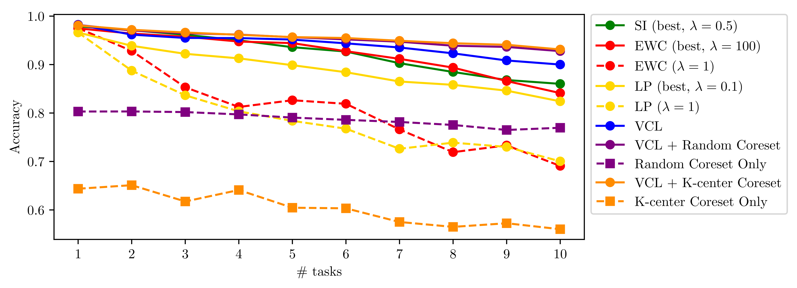

VCL+K-center核心集效果和 VCL+Random Coreset效果最好。

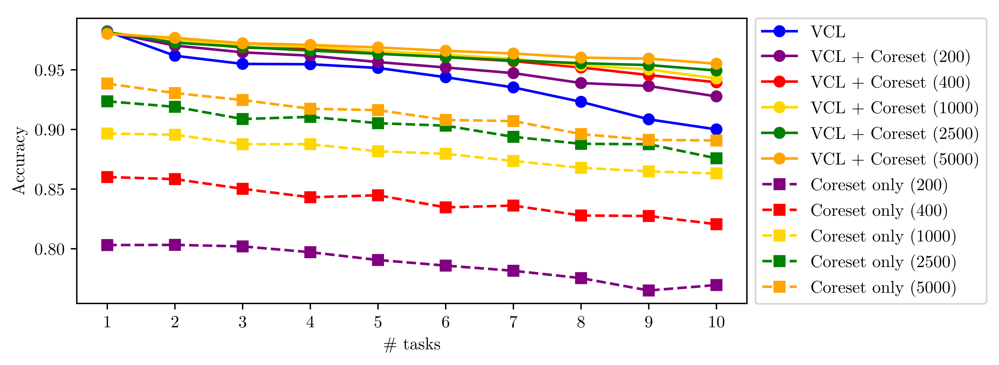

核心集大小越大，效果越好。

#### 分割的MNIST

提取的 MNIST 数据集中的五个二分类任务：0/1，2/3，4/5，6/7，以及 8/9。

我们使用全连接多头网络，包括两个隐藏层，每个隐藏层有 256 个隐藏单元，采用 ReLU 活性值。我们将 VCL（带和不带核心集）与 EWC、SI 和对角线 LP 进行比较。对于核心集，通过随机采样或 K-center 方法从每个任务中选择 40 个数据点。

在多任务实验中，VCL 算法表现优异（准确率 97.0%），虽略逊于 SI（98.9%），但显著强于 EWC 和 LP，且在添加核心集（Coresets）后准确率可进一步提升至 98.4%。

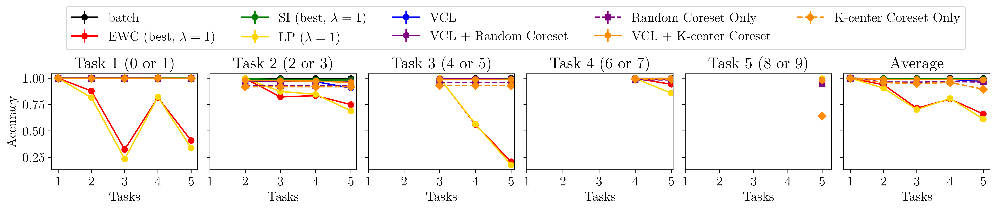

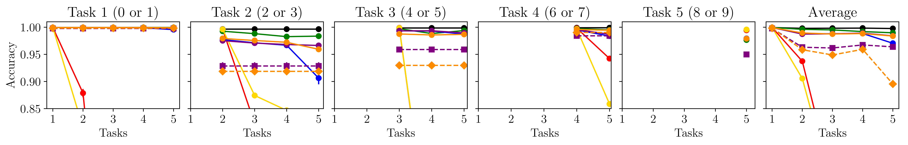

#### Split notMINST

notMNIST 数据集这里包含从 A 到 J 的不同字体风格的 400,000 张图像。

实验考虑了五个二分类任务：A/F、B/G、C/H、D/I 和 E/J，使用包含四层隐藏层（每层 150个隐藏单元）和 ReLU 激活函数的更深网络。其他情景与之前的实验保持相同。

VCL 与 SI表现相当，并且显著优于 EWC 和 LP。尽管 SI 和 EWC 基准受益于超参数搜索。VCL 在完成 5 个任务后达到 92.0% 的平均准确率，而 EWC、SI 和 LP 分别达到 71%、94% 和 63%。添加随机子集将 VCL 的性能提升至 96% 的准确率。

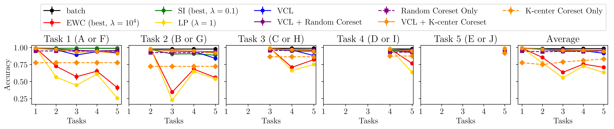

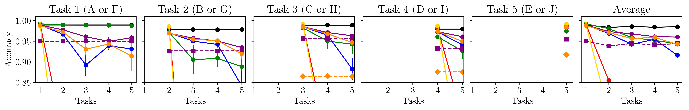

==高开低走==

### 深度生成模型的实验

论文考虑了两种针对深度生成模型的持续学习实验：MNIST 数字生成和 notMNIST（小）字符生成。

在这两种情况下，依次接收十个数据集。对于 MNIST，第一个数据集仅包含数字零的图像，第二个数据集包含数字一，依此类推。对于 notMNIST，数据集依次包含字母A 到 J。生成模型由共享组件和任务特定组件组成，每个组件均由一个具有 500 个隐藏单元的单隐藏层神经网络表示。潜变量 z 和中间表示 h 的维度分别为 50 和500。我们使用与生成器对称架构的任务特定编码器，这些编码器是神经网络。

VCL 表现最佳，其性能与 SI 相当或略好，并显著优于 LP 和 EWC。VCL 具有更强的长期记忆能力，且无需调整目标函数中的超参数。**朴素在线学习**：出现灾难性失败。**LP 与 EWC**：因使用相同的矩阵导致表现相似，且在任务差异较大时（如 MNIST 数字 0 转 1，任务的切换）性能显著下降。**SI**：在特定任务（数字 7）之后无法产生高测试对数似然结果。

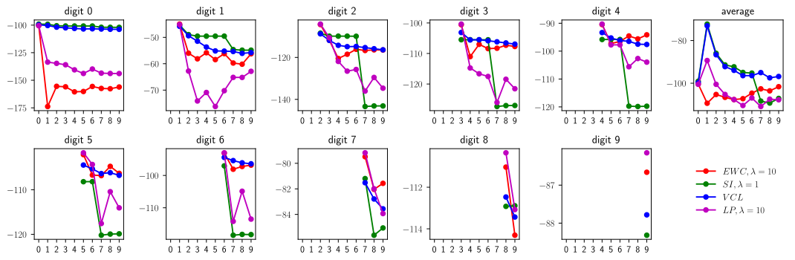

(a) Test-LL results on MNIST. The higher the better.

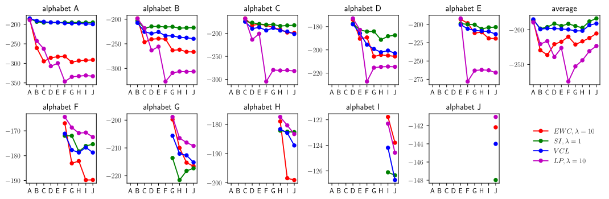

(b) Test-LL results on notMNIST. The higher the better.

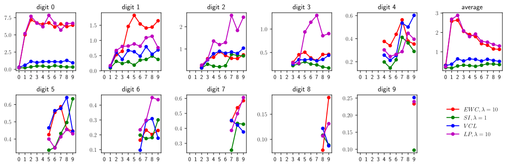

(c) Classifier uncertainty on MNIST. The lower the better.

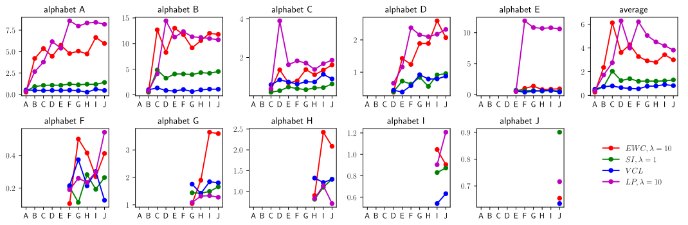

(d) Classifier uncertainty on notMNIST. The lower the better.

## 6. 结论

似贝叶斯推理为持续学习提供了一个自然的框架。本文提出的变分持续学习（VCL）是一种在此方向上的方法，它将在线变分推断扩展到处理更一般的持续学习任务和复杂的神经网络模型。。通过包含一个小的情景记忆，VCL 可以得到增强，该情景记忆利用了统计学中的核心集算法，并与变分消息传递中的消息调度相连接。我们展示了如何将 VCL 框架应用于判别模型和生成式模型。实验结果表明，与以往的持续学习方法相比，VCL 表现出最先进的性能，尽管其目标函数中没有自由参数。未来的工作应探索使用相同框架的其他近似推断方法，并开发更复杂的情景记忆。最后，我们注意到，VCL 非常适合于顺序决策问题中的高效模型优化，例如强化学习和主动学习。
